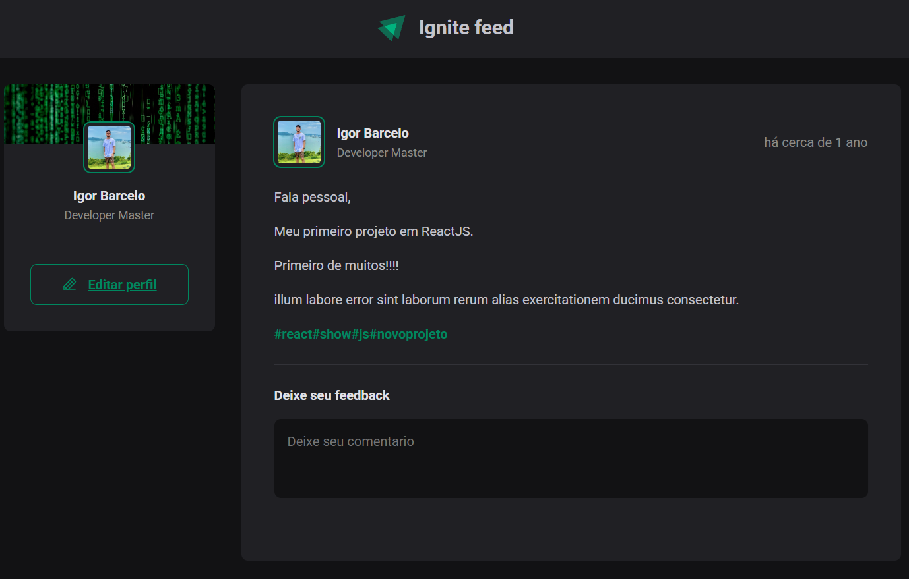

# ReactIgnite

🚀 Projeto desenvolvido como parte do bootcamp **Ignite** da **Rocketseat**. Trata-se de uma aplicação de feed de posts, construída com **React** e **Vite**, com foco em boas práticas de desenvolvimento front-end.

## 📸 Demonstração

> Adicione aqui uma imagem ou GIF da aplicação:
>
> 

---

## 📂 Acessando o Projeto

Para acessar o projeto, siga os passos abaixo:

1. **Clone o repositório:**

   ```bash
   git clone https://github.com/IgorBarcelo/ReactIgnite.git

2. **Entre na pasta do projeto:**

    ```bash
    cd ReactIgnite

3. **Instale as dependências:**

Com npm:

    ```bash
    npm install

Ou com yarn:

    ```bash
    yarn

## 🚀 Executando o Projeto

Depois de instalar as dependências, inicie o servidor de desenvolvimento com:

    ```bash
    npm run dev

ou

    ```bash
    yarn dev


A aplicação estará disponível em:
🔗 http://localhost:5173

## 🧰 Tecnologias Utilizadas

- React

- Vite

- JavaScript

- CSS Modules

- ESLint

##👨‍💻 Desenvolvedor

Igor Barcelo
🔗 github.com/IgorBarcelo